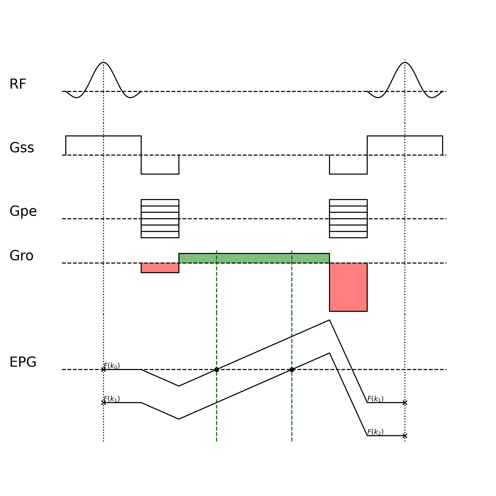

# Arbitrary order Multi-Echo Steady-State Free Precession (MESS)

## Introduction

+ Stead-State Free Precession (SSFP): First proposed by E. L. Hahn in 1950. Train of RF pulses with fixed repetition time (TR) and flip angle. Each RF pulse is followed by a combination of gradient pulses to encode the spatial information. The magnetization will reach a equilibrium state after a series of repetitions, which stands for the steady-state.
+ Extended Phase Graph (EPG): A theoretical framework to model the signal evolution of the magnetization in the presence of RF pulses and gradient pulses. The gradient could dephase the signal into higer order, while the RF pulse could rotate the isochromats. Based on the EPG analysis, the signal evolution could be described by a series of fourier coefficients in the transverse plane $F(k_n)$ and longitudinal axis $Z(k_n)$.
+ balanced SSFP (bSSFP/TrueFISP/): phase fully refocused at the end of each TR, where the stimulated echos overlap each other.
    + Pros: high signal intensity
    + Cons: sensitive to off-resonance effects, introduce banding artifacts. The stimulated echos has different echo times (TE), so the phase accumulation is different. The bSSFP image is equivalent to the complex sum of the echos, where the opposite phase of the stimulated echos cancel each other out and result in banding artifacts.
+ unbalanced SSFP: signal evolves into a higher order at the end of each TR, where phase is not fully refocused. 
    + GRE/FISP/GRASS/FFE: Acquire the zeroth-order free-induction-decay (FID) signal $F(k_0)$
    + PSIF/T2-FFE/SSFP-Echo: Acquire the -1st order signal $F(k_{-1})$
    + DESS: Acquire the 0th and -1st order signal $F(k_0)$ and $F(k_{-1})$
    + TESS: Acquire the 1st, 0th and -1st order signal $F(k_1)$, $F(k_0)$ and $F(k_{-1})$
    + MESS: First proposed by Chris T. Mizumoto et al. in 1991.
    + FLASH/SPGR: Note that sequence with RF spoiling is not considered here. Although these sequence also acquire the FID signal, RF pulses with quadratic phase increment will eventually reach a pesudo steady-state, where the stimulated echos from the higer order will be suppressed. The analysis in the following sections only consider the sequence with linear phase increment (phase-cycling).
+ In this work, we propose a general algorithm to generate the pulse sequence waveform for arbitrary order MESS sequence. 

## Theory

The extended phase graph (EPG) decompose the magnetization into a series of fourier coefficients in the transverse plane ($F(k_n)$) and longitudinal axis ($Z(k_n)$).

$$F(k_n)= \frac{1}{2\pi} \int_{-\pi}^{\pi} M_{xy}(\theta) e^{-jn\theta} d\theta, \quad n \in \mathbb{Z}$$

$$Z(k_n) = \frac{1}{2\pi} \int_{-\pi}^{\pi} M_z(\theta) e^{-jn\theta} d\theta, \quad n \in \mathbb{N}$$

$$k_n=n\phi_{\text{inc}} = n\gamma\int_0^{t_{\text{inc}}}G_\text{RO}(\tau)d\tau = n\gamma G_\text{RO}t_\text{inc}$$

The RF pulse induced rotation of the magnetization could be regarded as independent rotation of each isochromat. The rotation of the $n$-th isochromat is given by

$$\begin{bmatrix}
F^+(k_n) \\
F^+(k_{-n})\\
Z^+(k_n) \\
\end{bmatrix} = \mathbf{R}(\theta,\phi)\begin{bmatrix}
F^-(k_n) \\
F^-(k_{-n})\\
Z^-(k_n) \\
\end{bmatrix}$$

where the rotation matrix $\mathbf{R}(\theta,\phi)$ is given by

$$\mathbf{R}(\theta,\phi) = \begin{bmatrix} \cos^2 \frac{\alpha}{2} & e^{2i\phi} \sin^2 \frac{\alpha}{2} & -ie^{i\phi} \sin \alpha \\
e^{-2i\phi} \sin^2 \frac{\alpha}{2} & \cos^2 \frac{\alpha}{2} & ie^{-i\phi} \sin \alpha \\
 -\frac{i}{2} e^{-i\phi} \sin \alpha & \frac{i}{2} e^{i\phi} \sin \alpha & \cos \alpha
\end{bmatrix}$$

The evolution of states between the RF pulses is given by

$$\begin{aligned}
F_{n+1}^- &= E_2 F_n^+\\
Z_n^- &= E_1 Z_n^+,\quad n\ne 0\\
Z_0^- &= E_1 Z_n^+ + M_0(1-E_1)\\
\end{aligned}$$

Under the steady-state condition, the analytic solution for the $n$-th coefficient of the transverse magnetization after the RF pulse $F^+$ is given by \cite{leupold2017steady}

$$F^+(k_n) = \frac{M_0(1-E_1)}{(A-BE_2^2)\sqrt{1-a^2}}\left[\left(\frac{\sqrt{1-a^2}-1}{a}\right)^{|n|} - E_2\left(\frac{\sqrt{1-a^2}-1}{a}\right)^{|n+1|}\right]$$

$$\begin{aligned}
A &= 1 - E_1\cos(\alpha) \\
B &= E_1\sin(\alpha) \\
a &= \frac{E_2(B-A)}{A-BE_2^2} \\
\end{aligned}$$

the echo signal $S_n$ to be measured is given by

<!-- $$S_n(\text{TE}_n) = F_n^+ \underbrace{e^{-\text{TE}_n/T_2}}_{T_2\text{ relaxation}} \underbrace{e^{-\left|\text{TE}_n+n\text{TR}\right|/T_2'}}_{T_2'\text{ relaxation}}\underbrace{e^{j\omega_0(\text{TE}_n+n\text{TR})}}_{\text{off-resonance phase}}$$ -->
$$S_n(\text{TE}_n) = F_n^+ e^{-\text{TE}_n/T_2}e^{-\left|\text{TE}_n+n\text{TR}\right|/T_2'}e^{j\omega_0(\text{TE}_n+n\text{TR})}$$

where the $T_2$ and $T_2'$ relaxation terms are multiplied to the transverse magnetization after the RF pulse $F^+$, and the off-resonance phase term corresponds to the phase shift of the $n$-th echo due to the B0 field inhomogeneity.

With regards to the bSSFP sequence, all the echos are overlapped and the signal is given by

$$S(\text{TE}) = \sum_{n=-\infty}^{\infty} S_n(\text{TE}_n)$$

## Methods

## Example Results

The red area denotes the dephasing and rephasing gradients, the green area represents the readout gradient and the blue area stands for the spoiler gradient.

+ Conventional DESS ($F(k_0)$ and $F(k_{-1})$)

+ Modified DESS ($F(k_0)$ and $F(k_1)$)

+ Conventional TESS ($F(k_1)$, $F(k_0)$ and $F(k_{-1})$)

+ Modified TESS ($F(k_2)$, $F(k_1)$, $F(k_0)$ and $F(k_{-1})$, with spoiling gradient)

+ MESS ($F(k_{-2})$, $F(k_{-1})$, $F(k_0)$ and $F(k_{1})$, with spoiling gradient)

+ MESS ($F(k_{-2})$, $F(k_{-1})$, $F(k_0)$, $F(k_{1})$ and $F(k_{2})$, with spoiling gradient)

+ MESS ($F(k_1)$, $F(k_0)$, $F(k_{-1})$, $F(k_{-2})$, with spoiling gradient)

+ MESS ($F(k_1)$, $F(k_2)$, $F(k_3)$, $F(k_4)$, with spoiling gradient)

...