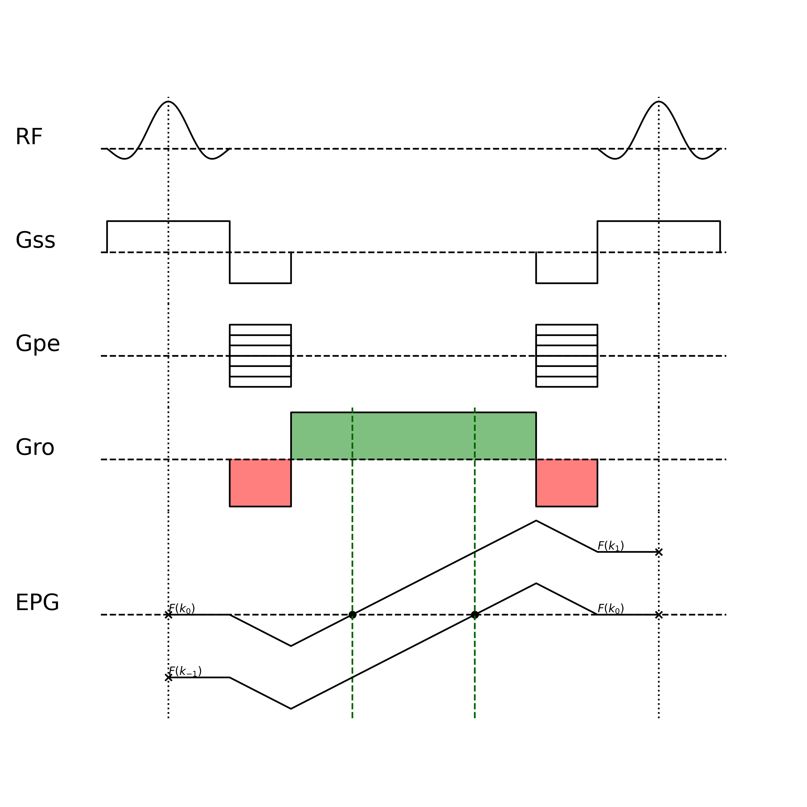
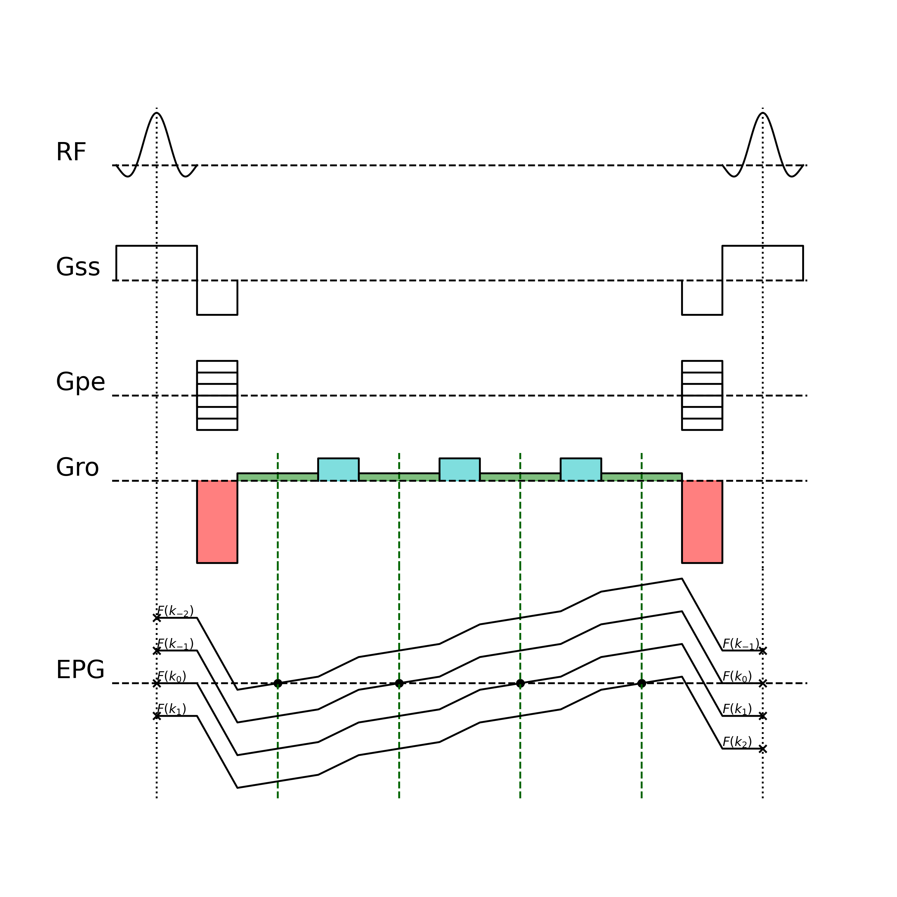
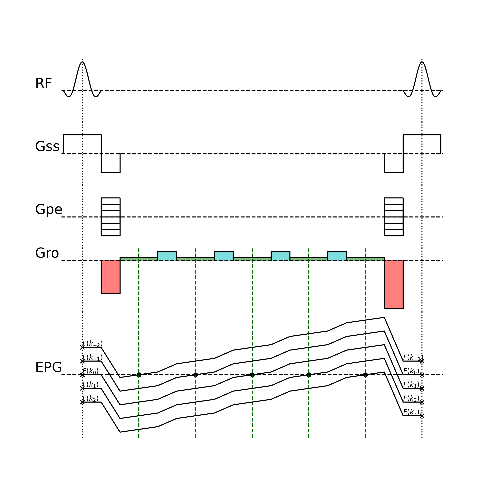
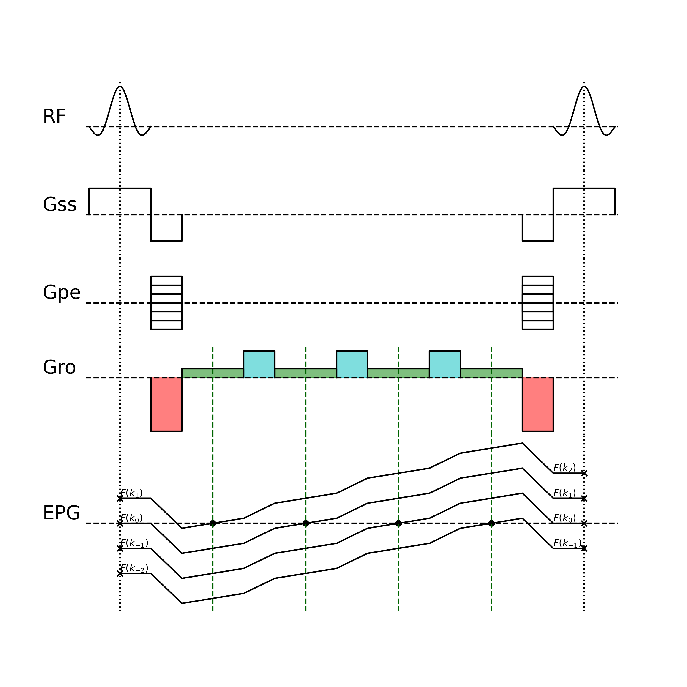
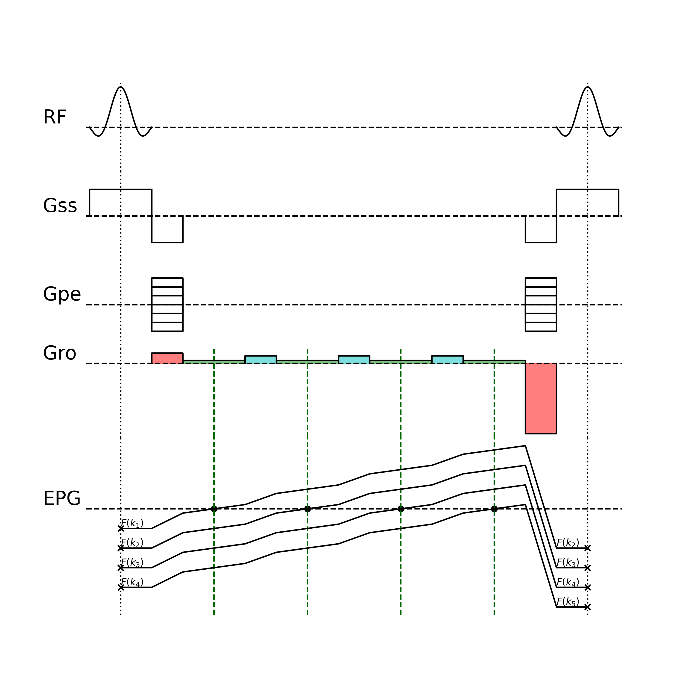

# Arbitrary order Multi-Echo Steady-State Free Precession (MESS)

## Introduction

+ Stead-State Free Precession (SSFP): First proposed by E. L. Hahn in 1950. Train of RF pulses with fixed repetition time (TR) and flip angle. Each RF pulse is followed by a combination of gradient pulses to encode the spatial information. The magnetization will reach a equilibrium state after a series of repetitions, which stands for the steady-state.
+ Extended Phase Graph (EPG): A theoretical framework to model the signal evolution of the magnetization in the presence of RF pulses and gradient pulses. The gradient could dephase the signal into higer order, while the RF pulse could rotate the isochromats. Based on the EPG analysis, the signal evolution could be described by a series of fourier coefficients in the transverse plane $F(k_n)$ and longitudinal axis $Z(k_n)$.
+ balanced SSFP (bSSFP/TrueFISP/): phase fully refocused at the end of each TR. Theoretically, bSSFP has no higher order of echoes
    + Pros: high signal intensity
    + Cons: sensitive to off-resonance effects, introduce banding artifacts. The stimulated echoes has different echo times (TE), so the phase accumulation is different. The bSSFP image is equivalent to the complex sum of the echoes, where the opposite phase of the stimulated echoes cancel each other out and result in banding artifacts.
+ unbalanced SSFP: signal evolves into a higher order at the end of each TR, where phase is not fully refocused. 
    + GRE/FISP/GRASS/FFE: Acquire the zeroth-order free-induction-decay (FID) signal $F(k_0)$
    + PSIF/T2-FFE/SSFP-Echo: Acquire the -1st order signal $F(k_{-1})$
    + DESS: Acquire the 0th and -1st order signal $F(k_0)$ and $F(k_{-1})$
    + TESS: Acquire the 1st, 0th and -1st order signal $F(k_1)$, $F(k_0)$ and $F(k_{-1})$
    + MESS: First proposed by Chris T. Mizumoto et al. in 1991.
    + FLASH/SPGR: Note that sequence with RF spoiling is not considered here. Although these sequence also acquire the FID signal, RF pulses with quadratic phase increment will eventually reach a pesudo steady-state, where the stimulated echoes from the higer order will be suppressed. The analysis in the following sections only consider the sequence with linear phase increment (phase-cycling).
+ In this work, we propose a general algorithm to generate the pulse sequence waveform for arbitrary order MESS sequence. The higher order of echo, 

## Theory

The extended phase graph (EPG) decompose the magnetization into a series of fourier coefficients in the transverse plane ($F(k_n)$) and longitudinal axis ($Z(k_n)$).

$$F(k_n)= \frac{1}{2\pi} \int_{-\pi}^{\pi} M_{xy}(\theta) e^{-jn\theta} d\theta, \quad n \in \mathbb{Z}$$

$$Z(k_n) = \frac{1}{2\pi} \int_{-\pi}^{\pi} M_z(\theta) e^{-jn\theta} d\theta, \quad n \in \mathbb{N}$$

$$k_n=n\phi_{\text{inc}} = n\gamma\int_0^{t_{\text{inc}}}G_\text{RO}(\tau)d\tau = n\gamma G_\text{RO}t_\text{inc}$$

The RF pulse induced rotation of the magnetization could be regarded as independent rotation of each isochromat. The rotation of the $n$-th isochromat is given by

$$\begin{bmatrix}
F^+(k_n) \\
F^+(k_{-n})\\
Z^+(k_n) \\
\end{bmatrix} = \mathbf{R}(\theta,\phi)\begin{bmatrix}
F^-(k_n) \\
F^-(k_{-n})\\
Z^-(k_n) \\
\end{bmatrix}$$

where the rotation matrix $\mathbf{R}(\theta,\phi)$ is given by

$$\mathbf{R}(\theta,\phi) = \begin{bmatrix} \cos^2 \frac{\alpha}{2} & e^{2i\phi} \sin^2 \frac{\alpha}{2} & -ie^{i\phi} \sin \alpha \\
e^{-2i\phi} \sin^2 \frac{\alpha}{2} & \cos^2 \frac{\alpha}{2} & ie^{-i\phi} \sin \alpha \\
 -\frac{i}{2} e^{-i\phi} \sin \alpha & \frac{i}{2} e^{i\phi} \sin \alpha & \cos \alpha
\end{bmatrix}$$

The evolution of states between the RF pulses is given by

$$\begin{aligned}
F^-(k_{n+1}) &= E_2 F^+(k_n)\\
Z^-(k_{n+1}) &= E_1 Z^+(k_n),\quad n\ne 0 \\
Z^-(k_0) &= E_1 Z^+(k_0) + M_0(1-E_1)\\
\end{aligned}$$

Under the steady-state condition, the analytic solution for the $n$-th coefficient of the transverse magnetization after the RF pulse $F^+(k_n)$ is given by \cite{leupold2017steady}

$$F^+(k_n) = \frac{M_0(1-E_1)\sin\alpha}{(A-BE_2^2)\sqrt{1-a^2}}\left[\left(\frac{\sqrt{1-a^2}-1}{a}\right)^{|n|} - E_2\left(\frac{\sqrt{1-a^2}-1}{a}\right)^{|n+1|}\right]$$

where the coefficients $A$, $B$ and $a$ are given by

$$\begin{aligned}
A &= 1 - E_1\cos(\alpha) \\
B &= E_1 - \cos(\alpha) \\
a &= \frac{E_2(B-A)}{A-BE_2^2} \\
\end{aligned}$$

The simplified expression for $F^+(k_{n\ge 0})$ and $F^+(k_{n<0})$ is derived as

$$F^+(k_{n\ge 0}) = c(1-E_2b) b^{n}$$
$$F^+(k_{n<0}) = c(1-E_2b^{-1}) b^{-n}$$

where the coefficients $b$ and $c$ are given by

$$\begin{aligned}
b &= \frac{\sqrt{1-a^2}-1}{a} \\
c &= \frac{M_0(1-E_1)\sin\alpha}{(A-BE_2^2)\sqrt{1-a^2}} \\
\end{aligned}$$

the echo signal $S(\text{TE}_n)$ to be measured is given by

$$S_n(\text{TE}_n) = F_n^+\cdot \underbrace{e^{-\text{TE}_n/T_2}}_{T_2\text{ relaxation}}\cdot \underbrace{e^{-\left|\text{TE}_n+n\text{TR}\right|/T_2'}}_{T_2'\text{ relaxation}}\cdot \underbrace{e^{j\Delta\omega_0(\text{TE}_n+n\text{TR})}}_{\text{off-resonance phase}}\cdot\underbrace{e^{j\{[u(n)-1]\pi-\Delta\psi n\}}}_{\text{RF phase-cycle}}$$
<!-- $$S(\text{TE}_n) = F_n^+ e^{-\text{TE}_n/T_2}e^{-\left|\text{TE}_n+n\text{TR}\right|/T_2'}e^{j\Delta\omega_0(\text{TE}_n+n\text{TR})}e^{j\{[u(n)-1]\pi-\Delta\psi n\}}$$ -->

The $T_2$ and $T_2'$ relaxation terms scale the transverse magnetization after the RF pulse $F^+$. The off-resonance phase term introduce the phase shift of the $n$-th echo due to the B0 field inhomogeneity, where $\Delta\omega_0 = 2\pi\gamma \Delta B_0$.

The phase-cycle term which was not included in Leupold's paper represent the phase increment of the $n$-th echo due to the phase-cycling of the RF pulse, where $\Delta\psi$ is the phase increment between the RF pulses and $u(n)$ corresponds to the unit step function. 

$$u(n) = \begin{cases}
1, & n\ge 0\\
0, & n<0\\
\end{cases}$$

The $B_0$ field map could be estimated by the phase difference between the echoes.

In our sequence, we acquire adjacent echoes with fixed echo spacing $\Delta\text{TE}$. The signal intensity of the $n$-th echo is expressed as $\text{TE}_n = \text{TE}_0+n\Delta\text{TE}$

The logarithm of the signal intensityis linearly related to $n$. For simplicity, we replace the linear coefficient term with $\mu^+$ and $\mu^-$, and the residual term with $\lambda^+$ and $\lambda^-$.

$$\log\left[|S(\text{TE}_n)|\right] = \log(|F^+(k_n)|) - \frac{\text{TE}_n}{T_2} - \frac{\left|\text{TE}_n+n\text{TR}\right|}{T_2'}$$

$$\begin{aligned}
\log\left[|S(\text{TE}_{n\ge 0})|\right] &= \log\left[c(1-E_2b)\right] + n\log(b) - \frac{\text{TE}_n}{T_2} - \frac{\text{TE}_n+n\text{TR}}{T_2'} \\
&= \left[\log(b) - \frac{\Delta\text{TE}}{T_2} - \frac{\Delta \text{TE}+\text{TR}}{T_2'} \right]n + \left\{\log\left[c(1-E_2b)\right] - \frac{\text{TE}_0}{T_2} - \frac{\text{TE}_0}{T_2'}\right\} \\
&= \lambda^+ n + \mu^+\\
\end{aligned}$$

$$\begin{aligned}
\log\left[|S(\text{TE}_{n< 0})|\right] &= \log\left[-c(1-E_2b^{-1})\right] - n\log(b) - \frac{\text{TE}_n}{T_2} + \frac{\text{TE}_n+n\text{TR}}{T_2'}\\
& = \left[-\log(b) - \frac{\Delta\text{TE}}{T_2} + \frac{\Delta \text{TE}+\text{TR}}{T_2'} \right]n + \left\{\log\left[-c(1-E_2b^{-1}\right)] - \frac{\text{TE}_0}{T_2} + \frac{\text{TE}_0}{T_2'}\right\}\\
&= \lambda^- n + \mu^-
\end{aligned}$$

The total signal intensity of the echoes is given by

$$\begin{aligned}
\sum_{n=-\infty}^{\infty} |S(\text{TE}_n)| &= \sum_{n=0}^\infty e^{\lambda^+ n + \mu^+} + \sum_{n=-\infty}^{-1} e^{\lambda^- n + \mu^-}\\
&= \frac{e^{\mu^+}}{1-e^{\lambda^+}} + \frac{e^{\mu^-}}{e^{\lambda^-}-1}\\
&= \frac{c(1-E_2b)e^{-\text{TE}_0/T_2-\text{TE}_0/T_2'}}{1-b e^{-\Delta\text{TE}/T_2+(\Delta\text{TE}+\text{TR})/T_2'}} + \frac{-c(1-E_2b^{-1})e^{-\text{TE}_0/T_2+\text{TE}_0/T_2'}}{b^{-1}e^{-\Delta\text{TE}/T_2+(\Delta\text{TE}+\text{TR})/T_2'} -1} \\
\end{aligned}$$

The magnitude sum of all the echoes is different from the signal intensity of the bSSFP sequence. The bSSFP image contrast as well as the banding artifacts could be readily generated by the complex sum of the echoes. The dark band is due to the phase cancellation from

$$\begin{aligned}
S_{\text{bSSFP(banding)}} &= \sum_{n=-\infty}^{\infty} S(\text{TE}_n)\\
&=\sum_{n=0}^{\infty} e^{\lambda^+ n + \mu^+ + j[\Delta\omega_0(\text{TE}_n+n\text{TR})-\Delta\psi n]} + \sum_{n=-\infty}^{-1} e^{\lambda^- n + \mu^- + j[\Delta\omega_0(\text{TE}_n+n\text{TR})+\pi-\Delta\psi n]}\\
&= \frac{e^{\mu^+ + j\Delta\omega_0\text{TE}_0}}{1-e^{\lambda^+ + j[\Delta\omega_0(\Delta\text{TE}+\text{TR})-\Delta\psi]}}  + \frac{e^{\mu^- + j\Delta\omega_0\text{TE}_0}}{1-e^{\lambda^- + j[\Delta\omega_0(\Delta\text{TE}+\text{TR})-\Delta\psi]}}\\
\end{aligned}$$

To generate the bSSFP image contrast without banding from the MESS echoes, it's straightforward to neglect the off-resonance phase term. The phase-cycle term should be preserved to maintain the image contrast.

$$\begin{aligned}
S_{\text{bSSFP(no banding)}} &= \sum_{n=-\infty}^{\infty} |S(\text{TE}_n)| e^{\{[u(n)-1]\pi-\Delta\psi n\}}
&=\sum_{n=0}^{\infty} e^{\lambda^+ n + \mu^+ + j[\Delta\omega_0(\text{TE}_n+n\text{TR})-\Delta\psi n]} + \sum_{n=-\infty}^{-1} e^{\lambda^- n + \mu^- + j[\Delta\omega_0(\text{TE}_n+n\text{TR})+\pi-\Delta\psi n]}\\
&= \frac{e^{\mu^+}}{1-e^{\lambda^+ - j\Delta\psi}}  + \frac{e^{\mu^- }}{1-e^{\lambda^- - j\Delta\psi}}\\
\end{aligned}$$

The coefficients $\hat\lambda^+$ and $\hat\lambda^-$ could be estimated from the signal intensity of the echoes through linear fitting. The $T_2$ relaxation time could be derived from the combination of the coefficients.

$$\lambda^++\lambda^-=-\frac{2\Delta\text{TE}}{T_2}\Longrightarrow\hat{T_2} = -\frac{2\Delta \text{TE}}{\hat\lambda^++\hat\lambda^-}$$

<!-- $$\lambda^+-\lambda^-=2\left[\log(b)-\cfrac{\Delta\text{TE}+\text{TR}}{T_2'}\right] \Longrightarrow \begin{cases}
b &= \exp\left(\cfrac{\hat\lambda^+-\hat\lambda^-}{2} + \cfrac{\Delta\text{TE}+\text{TR}}{T_2'}\right)\\
T_2' &= \cfrac{\Delta\text{TE}+\text{TR}}{\log(b)-\cfrac{\hat\lambda^+-\hat\lambda^-}{2}}\\
\end{cases}$$
$$\begin{aligned}
\mu^+ + \mu^- &= \log\left[c(1-E_2b)\right] + \log\left[-c(1-E_2b^{-1})\right] - \frac{2\text{TE}_0}{T_2} \\
&=\log\left[c^2(1-E_2(b+b^{-1})+E_2^2)\right]-\frac{2\text{TE}_0}{T_2}\\
\end{aligned}$$

$$\mu^+ - \mu^- = \log\left[\frac{E_2b-1}{1-E_2b^{-1}}\right]-\frac{2\text{TE}_0}{T_2'}$$ -->

The conventional DESS method to estimate $T_2$ with only 0th and -1st echo is based on the assumption of spin-echo relationship between the echoes. 

$$\frac{S(\text{TE}_{-1})}{S(\text{TE}_{0})}=e^{-2\frac{\text{TR}-\text{TE}_0}{T_2}}$$

$$\hat{T_2} = \frac{2(\text{TR}-\text{TE}_0)}{\log\left[S(\text{TE}_0)/S(\text{TE}_{-1})\right]} $$

B. Sveinsson et al. proposed a more accurate model of signal intensity to estimate $T_2$ with DESS sequence. However, their modeling only consider the 0th and -1st order, and ignore the contribution from the higher order echoes. Meanwhile, the method requires a prior knowledge of $T_1$ information, so it was only applied to cartilage imaging with a limited region of interest. 

$$\frac{S(\text{TE}_{-1})}{S(\text{TE}_{0})}=e^{-\frac{2(\text{TR} - \text{TE}_0)}{T_2}}\sin^{2}\left(\frac{\alpha}{2}\right)\frac{1 + e^{\frac{\text{TR}}{T_1}}}{(1-\cos(\alpha))e^{-\frac{\text{TR}}{T_1}}}$$

Based on our theory, the relationship between the DESS echoes can be derived as

$$\begin{aligned}
\frac{S(\text{TE}_{-1})}{S(\text{TE}_{0})}&=\frac{b-E_2}{E_2b-1}e^{\frac{\Delta\text{TE}}{T_2}+\frac{\Delta\text{TE}+\text{TR}-2\text{TE}_0}{T_2'}}
\end{aligned}$$

## Methods

## Exampbe Results

The red area denotes the dephasing and rephasing gradients, the green area represents the readout gradient and the blue area stands for the spoiler gradient.

+ Conventional DESS ($F(k_0)$ and $F(k_{-1})$)

+ Modified DESS ($F(k_0)$ and $F(k_1)$)

+ Conventional TESS ($F(k_1)$, $F(k_0)$ and $F(k_{-1})$)

+ Modified TESS ($F(k_2)$, $F(k_1)$, $F(k_0)$ and $F(k_{-1})$, with spoiling gradient)

+ MESS ($F(k_{-2})$, $F(k_{-1})$, $F(k_0)$ and $F(k_{1})$, with spoiling gradient)

+ MESS ($F(k_{-2})$, $F(k_{-1})$, $F(k_0)$, $F(k_{1})$ and $F(k_{2})$, with spoiling gradient)

+ MESS ($F(k_1)$, $F(k_0)$, $F(k_{-1})$, $F(k_{-2})$, with spoiling gradient)

+ MESS ($F(k_1)$, $F(k_2)$, $F(k_3)$, $F(k_4)$, with spoiling gradient)

...